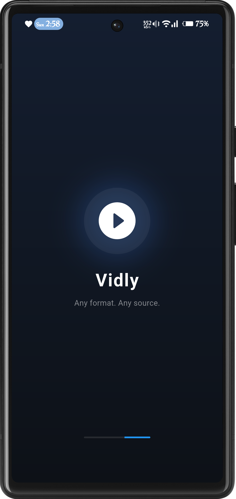
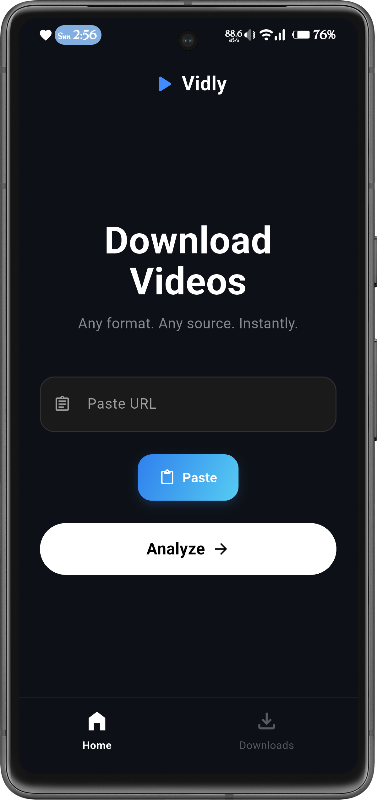
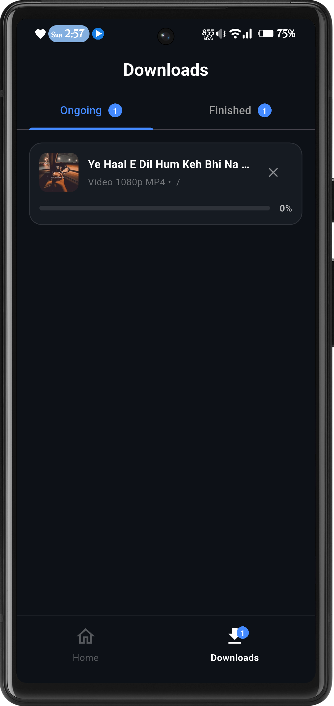
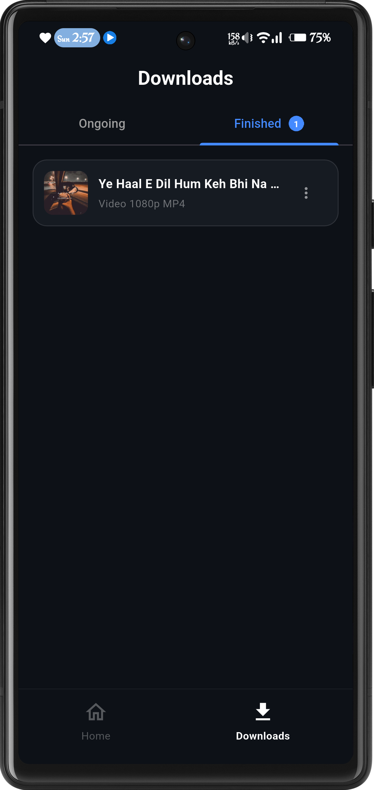

<p align="center">
  
</p>

<h1 align="center">Vidly</h1>

<p align="center">
  <strong>A Premium, High-Performance Video & Audio Downloader</strong><br>
  Built with Flutter, GetX, and Clean Architecture.
</p>

---

## 📖 Introduction

**Vidly** is a high-performance media utility designed for speed and a seamless user experience. By
utilizing a powerful **Third-Party Media Parsing API**, Vidly can accurately extract high-quality
video and audio streams from a wide range of web sources. Beyond downloading, Vidly features a
built-in playback engine, allowing you to enjoy your saved content directly within the app.

---

## 📱 Visual Overview

### Core UI Flow

|        Splash Screen         |      Home Analysis       |         Quality Selection         |
|:----------------------------:|:------------------------:|:---------------------------------:|
|  |  |  |
|       Initializing App       |      URL Extraction      |          Format Picking           |

### Download & Playback

|              Ongoing Tasks              |             Completed Library             |        Media Playback         |
|:---------------------------------------:|:-----------------------------------------:|:-----------------------------:|
|  |  |  |
|             Active Progress             |              Offline Storage              |      Video/Audio Player       |

---

## ✨ Features

### 🔍 Advanced Media Extraction

* **Third-Party API Integration**: Leverages a robust cloud-based parser to fetch direct media
  links, ensuring high compatibility and fast metadata extraction.
* **Smart Intent Handling**: Automatically detects and parses URLs shared from other applications
  via system intents.

### ⚡ Real-Time Notifications

* **Instant Feedback**: Features an advanced notification system that provides immediate "Download
  Started" alerts.
* **Live Progress Tracking**: Continuous updates via interactive notification progress bars.
* **Rich Previews**: Notifications display video thumbnails and allow for "Open File" actions
  immediately upon completion.

### 🎬 Integrated Media Player

* **High-Quality Video Playback**: Built-in video player supports multiple resolutions and formats (
  MP4, MKV, etc.).
* **Audio Playback Engine**: Seamlessly play extracted MP3 files with a dedicated audio interface.
* **Offline Access**: Play your downloaded media anytime without requiring an internet connection.

### 🎨 Premium UI/UX

* **Custom Selection UI**: A beautifully designed bottom sheet with rounded borders and selection
  states for choosing quality.
* **Clean Formatting**: Easy-to-read resolution labels such as **FULL HD (1080p)**, **HD (720p)**,
  and **SD**.

---

## 🛠 Tech Stack

* **State Management**: [GetX](https://pub.dev/packages/get) (Dependency Injection & Reactive State)
* **Networking**: [Dio](https://pub.dev/packages/dio) (Handling API requests and file streaming)
* **Local Database**: [Hive](https://pub.dev/packages/hive) (Persistent download history)
* **Notifications**: [Awesome Notifications](https://pub.dev/packages/awesome_notifications) (Custom
  UI for progress and media previews)
* **Playback
  **: [Video Player](https://pub.dev/packages/video_player) & [Just Audio](https://pub.dev/packages/just_audio)

---

## 📂 Project Structure

```text
lib/
 ├── controller/      # Business logic for home, downloads, and playback state
 ├── core/            # App branding, constants, and global utilities
 ├── data/            
 │    ├── providers/  # API service implementations for third-party parsing
 │    └── repository/ # Data abstraction and task management
 ├── views/           # UI Screens (Home, Preview, Downloads) and custom widgets
 └── main.dart        # Entry point and dependency initialization